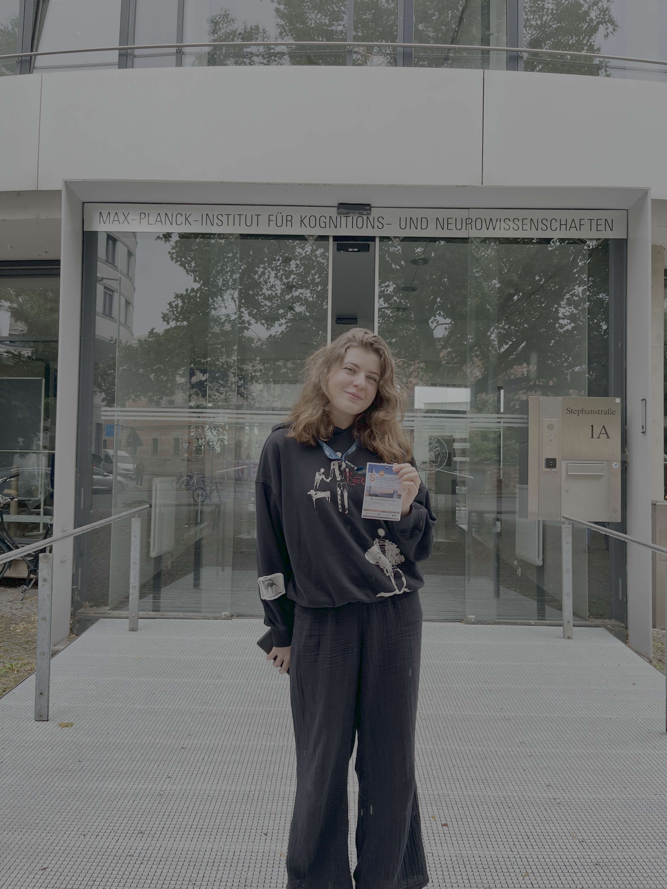
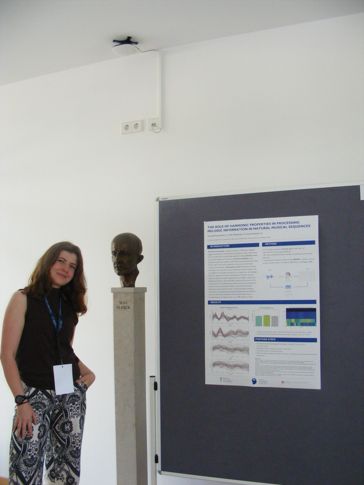

+++
title = 'Kornelia and Zosia Attend the 2nd IMPRS CoNI Summer School in Leipzig'
date = 2026-07-01T12:39:48+02:00
draft = false
+++

In June, Kornelia and Zosia had the opportunity to take part in the 2nd Summer School of the International Max Planck Research School on Cognitive NeuroImaging, held in Leipzig. Over the course of three days, they attended numerous lectures and workshops covering several thematic blocks, including Evolution of Brain Structure and Function, Network Disorders, and Methodological Advances in Neurostimulation Research. 

[https://imprs-coni.mpg.de/summer-school-2026](https://imprs-coni.mpg.de/summer-school-2026)

The school also included poster sessions, where they presented a poster on their own research. In addition, the girls had the chance to exchange experiences with other participants during networking events, where they met many PhD students from the International Max Planck Research School who answered all their pressing questions about pursuing a doctorate abroad.

