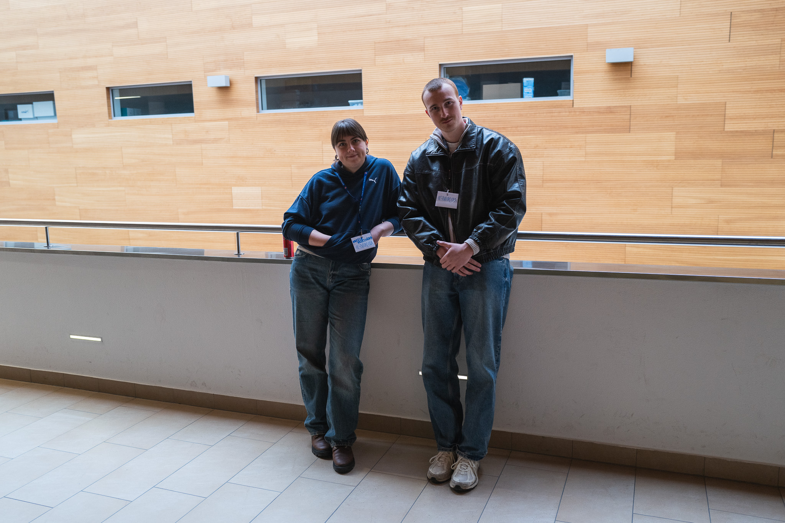

+++
title = 'Non-linear relationships between auditory mismatch responses and the inharmonicity of complex sounds'
date = 2026-03-06T12:39:48+02:00
draft = false
+++
Aniela and Bartek's first published paper is out now in Scientific Reports! It grew out of their master thesis, exploring pitch perception and harmonicity through EEG. The study looked at how the brain's mismatch responses (MMN and P3a) change as sounds get progressively more inharmonic, and found that the relationship isn't a straight line - MMN amplitude follows a sigmoid curve, dropping off sharply once inharmonicity crosses a certain threshold, right around where pitch discrimination also starts to break down.

Read the whole article here: [https://www.nature.com/articles/s41598-026-41129-7](https://www.nature.com/articles/s41598-026-41129-7)

